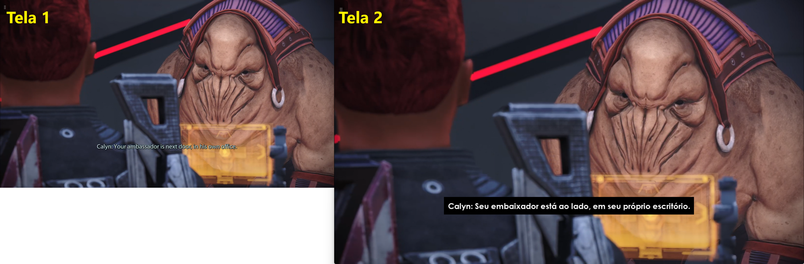
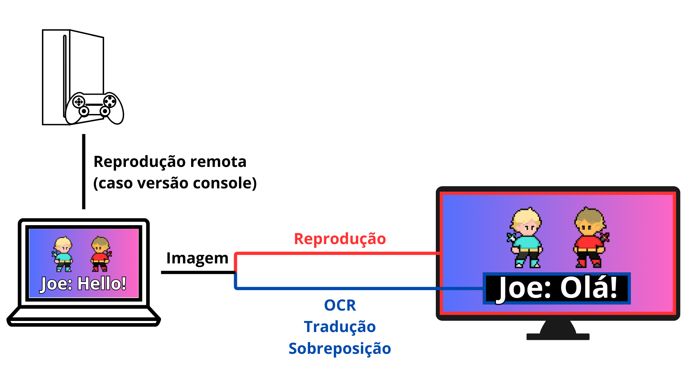
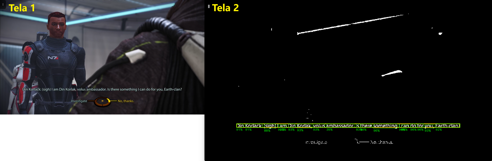

# Mass-Effect-Realtime-PTBR

Projeto que visa a tradução em tempo real dos jogos da trilogia [Mass Effect&trade;](https://pt.wikipedia.org/wiki/Mass_Effect).

**Nota: Atualmente, o projeto suporta apenas a tradução das legendas de diálogos e funciona apenas em SO Windows.**



## Configuração testada

**Versão de jogo:** [Mass Effect&trade; Legendary Edition](https://pt.wikipedia.org/wiki/Mass_Effect:_Legendary_Edition)  
**Plataforma de jogo:** Xbox Series X  
**Sistema Operacional:** Windows 11  
**Reprodução remota:** aplicativo Xbox para Windows  
**Versão Python:** 3.12.5

## Instalação

Em um novo ambiente virtual Python, execute:

```
pip install -r requirements.txt
```

Além disso, é necessário [instalar](https://tesseract-ocr.github.io/tessdoc/Installation.html) a versão Windows do [Tesseract](https://github.com/tesseract-ocr/tesseract), *engine* de reconhecimento de texto *open-source* do Google. Atualmente, é esperada a instalação no caminho `C:\Arquivos de Programas\Tesseract-OCR`.

## Execução

Para iniciar o programa a partir do diretório raiz, execute:

```
python src/main.py
```

## Funcionamento

Para o devido funcionamento da aplicação, os seguintes requisitos devem ser atendidos:

* As legendas do jogo devem estar habilitadas;
* A imagem do jogo deve ser transmitida pelo mesmo PC que executa esta aplicação. Para versões de console, isso é possível através da transmissão remota console-PC;
* Um segundo monitor deve estar conectado ao PC para transmissão do jogo com as legendas traduzidas;
* O PC deve estar conectado à internet.

Uma vez que a aplicação é iniciada, a tela do computador é constantemente pré-processada e submetida ao algoritmo de OCR (*Optical Character Recognition* - Reconhecimento Óptico de Caractere), destinado ao reconhecimento de texto em imagem. Quando uma legenda de diálogo é detectada, ela é traduzida através do serviço *Google Tradutor*. Simultaneamente, a tela do computador é continuamente replicada no último monitor detectado no *setup*, sobrepondo as eventuais legendas detectadas por sua versão traduzida.



## Modo desenvolvedor

Caso você esteja trabalhando a partir deste projeto ou apenas tenha curiosidade de ver melhor o seu funcionamento, alguns atalhos do teclado podem ajudar:

* `t`: visualizar/ocultar legendas traduzidas;
* `d`: habilitar/desabilitar visualização da imagem do jogo pré-processada antes da submissão ao OCR;
* `b`: visualizar/ocultar caixas delimitadoras ao redor das legendas detectadas;
* `w`: visualizar/ocultar caixas delimitadoras ao redor de cada palavra da legenda, bem como o grau de confiança da detecção.

